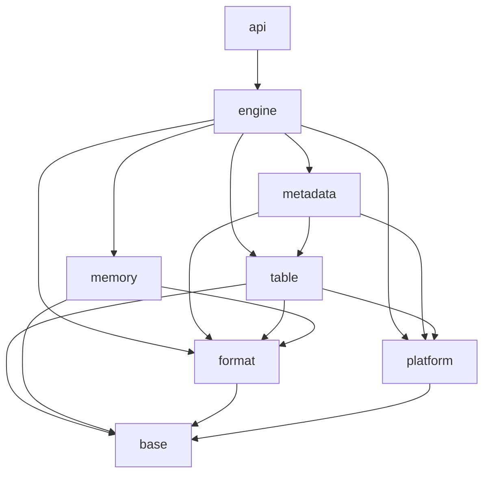

# Implementation Dependency DAG

## Purpose

Modern LevelDB is implemented as a directed acyclic graph of independently
verifiable modules. Dependency edges represent compile-time or semantic
prerequisites, not scheduling preferences.

Only one implementation node is developed at a time. Independent ready nodes
remain pending until the current node is complete.

## Layer graph

Arrows point from a dependent layer to a prerequisite layer.

## Nodes and direct dependencies

| Node | Deliverable | Direct dependencies |
|---|---|---|
| `document-architecture` | Architecture analysis, DAG, and ADRs | None |
| `bootstrap-build` | C++23 CMake and CTest foundation | `document-architecture` |
| `implement-bytes` | Byte views and conversions | `bootstrap-build` |
| `implement-error-result` | Typed errors and `Result<T>` | `bootstrap-build` |
| `implement-comparator` | Bytewise comparator contract | `implement-bytes` |
| `implement-coding` | Fixed-width and varint coding | `implement-bytes`, `implement-error-result` |
| `implement-checksum-hash` | CRC32C and stable hash | `implement-coding` |
| `implement-arena` | Monotonic arena | `bootstrap-build` |
| `implement-platform-runtime` | Clock and background executor | `implement-error-result` |
| `implement-platform-fs` | Filesystem and file interfaces | `implement-bytes`, `implement-error-result` |
| `implement-internal-key` | Internal-key format and ordering | `implement-bytes`, `implement-error-result`, `implement-coding`, `implement-comparator` |
| `implement-wal-format` | WAL physical-record format | `implement-bytes`, `implement-error-result`, `implement-coding`, `implement-checksum-hash` |
| `implement-cache` | Sharded RAII block cache | `implement-bytes`, `implement-error-result`, `implement-checksum-hash` |
| `implement-skiplist` | Concurrent-read skip list | `implement-arena` |
| `implement-write-batch` | Atomic batch format | `implement-internal-key`, `implement-coding`, `implement-error-result` |
| `implement-memtable` | Arena-backed mutable table | `implement-internal-key`, `implement-arena`, `implement-skiplist` |
| `implement-wal-io` | WAL reader and writer | `implement-platform-fs`, `implement-wal-format` |
| `implement-filenames` | Database filename model | `implement-error-result` |
| `implement-version-edit` | MANIFEST edit format | `implement-internal-key`, `implement-coding`, `implement-error-result` |
| `implement-block-format` | Data blocks, handles, footer, trailers | `implement-bytes`, `implement-error-result`, `implement-coding`, `implement-checksum-hash`, `implement-comparator` |
| `implement-filter` | Bloom and filter blocks | `implement-bytes`, `implement-checksum-hash` |
| `implement-sstable-writer` | SSTable construction | `implement-platform-fs`, `implement-block-format`, `implement-filter` |
| `implement-sstable-reader` | SSTable reads and iteration | `implement-platform-fs`, `implement-block-format`, `implement-filter`, `implement-cache` |
| `implement-table-cache` | Cached SSTable handles | `implement-sstable-reader`, `implement-cache`, `implement-filenames` |
| `implement-version-set` | Versions and MANIFEST state | `implement-version-edit`, `implement-filenames`, `implement-sstable-reader`, `implement-wal-io` |
| `implement-recovery` | MANIFEST and WAL recovery | `implement-wal-io`, `implement-write-batch`, `implement-memtable`, `implement-version-set` |
| `implement-read-path` | Point reads and merged iteration | `implement-memtable`, `implement-table-cache`, `implement-version-set` |
| `implement-write-path` | Group commit and memtable insertion | `implement-wal-io`, `implement-write-batch`, `implement-memtable`, `implement-version-set` |
| `implement-flush` | Immutable memtable to L0 | `implement-memtable`, `implement-sstable-writer`, `implement-version-set` |
| `implement-compaction` | Leveled compaction | `implement-sstable-reader`, `implement-sstable-writer`, `implement-version-set` |
| `implement-db-engine` | Integrated DB lifecycle | `implement-recovery`, `implement-read-path`, `implement-write-path`, `implement-flush`, `implement-compaction`, `implement-platform-runtime` |
| `implement-public-api` | Public RAII C++ API | `implement-db-engine` |
| `build-compatibility-harness` | Model, golden, differential, crash, and fuzz tests | `implement-public-api` |
| `harden-engine` | Sanitizer, crash, fuzz, and benchmark gates | `build-compatibility-harness` |

Each node includes its own unit and applicable format/fault tests. The later
compatibility-harness node integrates end-to-end scenarios; it does not defer
lower-level validation.

## Canonical topological order

The DAG allows more than one valid topological sort. The project uses this
canonical order to keep development sequential and reviewable:

1. `document-architecture`
2. `bootstrap-build`
3. `implement-bytes`
4. `implement-error-result`
5. `implement-comparator`
6. `implement-coding`
7. `implement-checksum-hash`
8. `implement-arena`
9. `implement-platform-runtime`
10. `implement-platform-fs`
11. `implement-internal-key`
12. `implement-wal-format`
13. `implement-cache`
14. `implement-skiplist`
15. `implement-write-batch`
16. `implement-memtable`
17. `implement-wal-io`
18. `implement-filenames`
19. `implement-version-edit`
20. `implement-block-format`
21. `implement-filter`
22. `implement-sstable-writer`
23. `implement-sstable-reader`
24. `implement-table-cache`
25. `implement-version-set`
26. `implement-recovery`
27. `implement-read-path`
28. `implement-write-path`
29. `implement-flush`
30. `implement-compaction`
31. `implement-db-engine`
32. `implement-public-api`
33. `build-compatibility-harness`
34. `harden-engine`

## Completion rule

A node is complete only when:

- Its observable behavior is first expressed by a failing unit test.
- The failing test is observed before production implementation begins.
- The smallest implementation needed to make the new test pass is added.
- Refactoring occurs only after the focused and existing unit tests are green.
- Its public contract is documented.
- Its dependency direction follows the architecture rules.
- Focused tests cover successful, boundary, malformed, and failure behavior.
- Sanitizer-compatible code contains no owning raw pointers.
- Persistent-format nodes and shared binary codecs have independent LevelDB
  golden-vector tests.
- Performance-sensitive nodes have a baseline before optimization.

Algorithm changes are not combined with unrelated ownership or API refactors.
