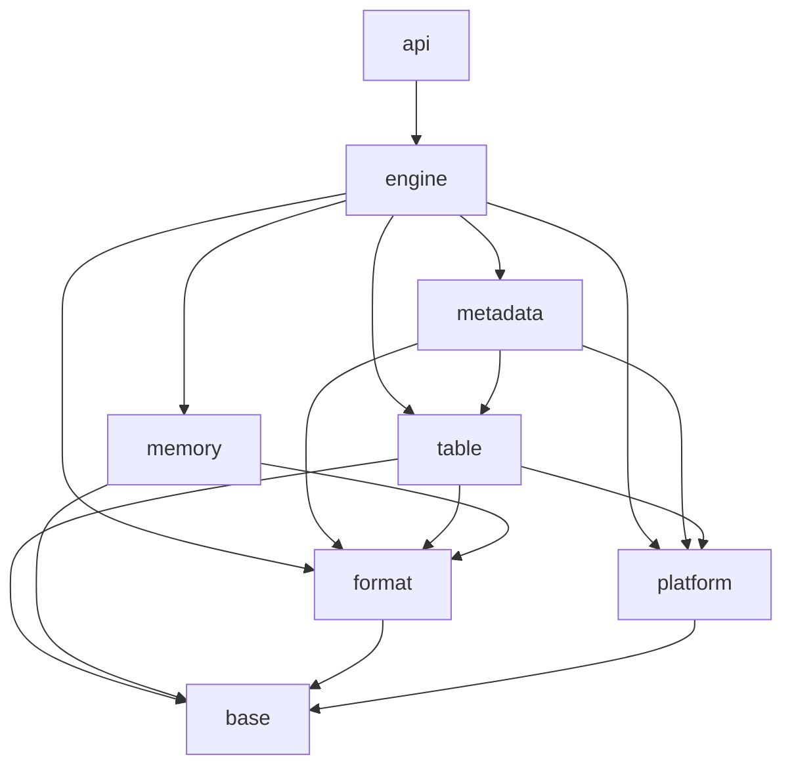

# Implementation Dependency DAG

## Purpose

Modern LevelDB is implemented as a directed acyclic graph of independently
verifiable modules. Dependency edges represent compile-time or semantic
prerequisites, not scheduling preferences.

Only one implementation node is developed at a time. Independent ready nodes
remain pending until the current node is complete.

## Layer graph

Arrows point from a dependent layer to a prerequisite layer.

## Nodes and direct dependencies

| Node | Deliverable | Direct dependencies |
|---|---|---|
| `document-architecture` | Architecture analysis, DAG, and ADRs | None |
| `bootstrap-build` | C++23 CMake and CTest foundation | `document-architecture` |
| `implement-bytes` | Byte views and conversions | `bootstrap-build` |
| `implement-error-result` | Typed errors and `Result<T>` | `bootstrap-build` |
| `implement-comparator` | Bytewise comparator contract | `implement-bytes` |
| `implement-coding` | Fixed-width and varint coding | `implement-bytes`, `implement-error-result` |
| `implement-checksum-hash` | CRC32C calculation/extension/masking and LevelDB-compatible seeded hash | `implement-coding` |
| `implement-arena` | Non-movable monotonic arena with small-block allocation, max-alignment, and reserved-byte accounting | `implement-bytes` |
| `implement-platform-runtime` | Steady clock, stop-aware sleep, and serial RAII background executor | `implement-error-result` |
| `implement-platform-fs` | Minimal file interfaces and Linux/macOS POSIX backend with explicit durability primitives | `implement-bytes`, `implement-error-result` |
| `implement-internal-key` | LevelDB-compatible immutable internal keys, parsing, and ordering | `implement-bytes`, `implement-error-result`, `implement-coding`, `implement-comparator` |
| `implement-wal-format` | LevelDB-compatible pure WAL fragmentation and physical-record decoding | `implement-bytes`, `implement-error-result`, `implement-coding`, `implement-checksum-hash` |
| `implement-cache` | Typed 16-shard RAII LRU cache with charge-based eviction and pin handles | `implement-bytes`, `implement-error-result`, `implement-checksum-hash` |
| `implement-skiplist` | Single-writer concurrent-reader arena-backed skip list | `implement-arena` |
| `implement-write-batch` | Original-LevelDB-compatible Put/Delete batch builder and zero-copy reader | `implement-internal-key`, `implement-coding`, `implement-error-result` |
| `implement-memtable` | Packed arena-backed, single-writer/concurrent-reader MemTable with snapshot lookup and iteration | `implement-internal-key`, `implement-coding`, `implement-arena`, `implement-skiplist` |
| `implement-wal-io` | Owned WAL stream reader/writer with logical reassembly, corruption events, flush, sync, and close | `implement-platform-fs`, `implement-wal-format` |
| `implement-filenames` | Pure database file-name generation and parsing, and validated `CURRENT` contents | `implement-error-result` |
| `implement-version-edit` | LevelDB-compatible MANIFEST version-edit encoding and validated decoding | `implement-internal-key`, `implement-coding`, `implement-error-result` |
| `implement-block-format` | LevelDB-compatible sorted blocks, block handles, footer, and checksummed trailers | `implement-bytes`, `implement-error-result`, `implement-coding`, `implement-checksum-hash`, `implement-comparator` |
| `implement-filter` | LevelDB-compatible Bloom filter policy and validated SSTable filter blocks | `implement-bytes`, `implement-error-result`, `implement-coding`, `implement-checksum-hash` |
| `implement-sstable-writer` | Durable LevelDB-compatible SSTable construction from ordered internal-key entries | `implement-platform-fs`, `implement-internal-key`, `implement-block-format`, `implement-filter` |
| `implement-sstable-reader` | Validated SSTable lookups, bidirectional iteration, and block caching | `implement-platform-fs`, `implement-internal-key`, `implement-block-format`, `implement-filter`, `implement-cache` |
| `implement-table-cache` | LRU cache of open SSTables by file number | `implement-sstable-reader`, `implement-cache`, `implement-filenames` |
| `implement-version-set` | Immutable versions, validated edits, and MANIFEST and `CURRENT` persistence | `implement-version-edit`, `implement-filenames`, `implement-wal-io` |
| `implement-table-build` | Durable, verified level-0 SSTable from a memtable | `implement-memtable`, `implement-version-edit`, `implement-sstable-writer`, `implement-table-cache` |
| `implement-recovery` | Locked database opening, creation, and WAL replay into level-0 tables with a new log | `implement-wal-io`, `implement-write-batch`, `implement-memtable`, `implement-version-set`, `implement-table-build` |
| `implement-read-path` | Point reads through memtables and versions | `implement-memtable`, `implement-table-cache`, `implement-version-set` |
| `implement-iterators` | Merged internal iteration and snapshot iteration of user keys | `implement-memtable`, `implement-sstable-reader`, `implement-table-cache`, `implement-version-set` |
| `implement-write-path` | Group commit and memtable insertion | `implement-wal-io`, `implement-write-batch`, `implement-memtable`, `implement-version-set` |
| `implement-flush` | Immutable memtable to a table and its version edit | `implement-memtable`, `implement-table-build`, `implement-table-cache`, `implement-version-set` |
| `implement-compaction-picking` | Compaction scores, inputs, grandparents, and trivial moves | `implement-version-set` |
| `implement-compaction` | Merged compaction into split, verified tables and its version edit | `implement-compaction-picking`, `implement-iterators`, `implement-sstable-writer`, `implement-table-cache`, `implement-version-set` |
| `implement-seek-statistics` | Seek budgets charged by point reads and iterator samples | `implement-compaction-picking`, `implement-read-path`, `implement-iterators` |
| `implement-db-engine` | Database lifecycle, writes, reads, snapshots, flushes, and cleanup | `implement-recovery`, `implement-read-path`, `implement-iterators`, `implement-write-path`, `implement-flush`, `implement-table-cache`, `implement-platform-runtime` |
| `implement-db-compactions` | Background compactions, write throttling, and seek charges | `implement-db-engine`, `implement-compaction-picking`, `implement-compaction`, `implement-seek-statistics` |
| `implement-public-api` | Public RAII C++ API | `implement-db-compactions` |
| `implement-compression` | Snappy and Zstd SSTable block compression | `implement-sstable-writer`, `implement-sstable-reader` |
| `build-compatibility-harness` | Model, golden, differential, crash, and fuzz tests | `implement-public-api`, `implement-compression` |
| `harden-engine` | Sanitizer, crash, fuzz, and benchmark gates | `build-compatibility-harness` |

Each production-code node includes its own unit and applicable format/fault
tests. The later compatibility-harness node integrates end-to-end scenarios;
it does not defer lower-level validation.

## Canonical topological order

The DAG allows more than one valid topological sort. The project uses this
canonical order to keep development sequential and reviewable:

1. `document-architecture`
2. `bootstrap-build`
3. `implement-bytes`
4. `implement-error-result`
5. `implement-comparator`
6. `implement-coding`
7. `implement-checksum-hash`
8. `implement-arena`
9. `implement-platform-runtime`
10. `implement-platform-fs`
11. `implement-internal-key`
12. `implement-wal-format`
13. `implement-cache`
14. `implement-skiplist`
15. `implement-write-batch`
16. `implement-memtable`
17. `implement-wal-io`
18. `implement-filenames`
19. `implement-version-edit`
20. `implement-block-format`
21. `implement-filter`
22. `implement-sstable-writer`
23. `implement-sstable-reader`
24. `implement-table-cache`
25. `implement-version-set`
26. `implement-table-build`
27. `implement-recovery`
28. `implement-read-path`
29. `implement-iterators`
30. `implement-write-path`
31. `implement-flush`
32. `implement-compaction-picking`
33. `implement-compaction`
34. `implement-seek-statistics`
35. `implement-db-engine`
36. `implement-db-compactions`
37. `implement-public-api`
38. `implement-compression`
39. `build-compatibility-harness`
40. `harden-engine`

## Completion rule

Validation depends on the kind of node. Production-code behavior uses TDD;
build-system nodes use appropriate configure, build, and test-integration
checks. Documentation-only nodes, including `document-architecture`, require
review of accuracy, consistency, references, and dependency ordering, not an
artificial failing unit test.

A production-code node is complete only when:

- New or changed behavior is first expressed by a failing unit test.
- For behavior changes, the expected failure is observed before implementing
  the smallest correct change.
- Behavior-preserving refactors keep the focused and existing unit tests green
  before and after the change.
- Its public contract is documented.
- Its dependency direction follows the architecture rules.
- Focused tests cover successful, boundary, malformed, and failure behavior.
- Sanitizer-compatible code contains no owning raw pointers.
- Persistent-format nodes and shared binary codecs have independent LevelDB
  golden-vector tests.
- Performance-sensitive nodes have a baseline before optimization.

Algorithm changes are not combined with unrelated ownership or API refactors.
